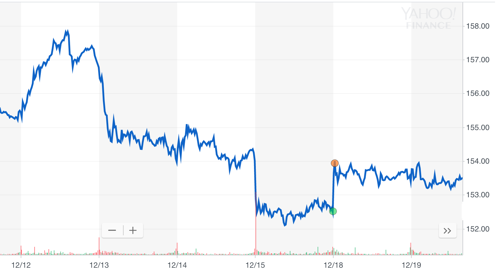
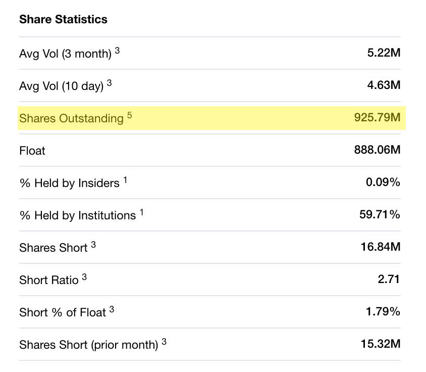

```{r, include=FALSE}
source('./foo.R')
```

# Conociendo datos y términos financieros {#conociendo-datos}

Nuestro destino final: la optimización de la diversificación de portafolios, para llegar ahí debemos primero hacer un viaje por el mundo de términos que se utilizan en la industria de manejo de portafolios. Por esto, en este capítulo no solo se va familiarizar al lector con los conceptos utilizados frecuentemente por los manejadores de portafolios. El objetivo principal será construir las funciones básicas de una paquetería de optimización de portafolios. Estas funciones nos permitirán manipular rápidamente los precios de activos. 

En la sección \@ref(paqueterias-r) de este capítulo, empezamos preparando la caja de herramientas que necesitamos para armar nuestra paquetería de optimización de portafolios en **R**. En particular resulta práctico conocer como se contruyen los objetos **xts**, éstos objetos contienen series de tiempo.

En la sección \@ref(precios-acciones) construimos la función `get_prices_yahoo()` con la que vamos a extraer los datos que utilizaremos en el resto del trabajo. Esta función obtiene precios de acciones de Yahoo! Finance y produce objetos **xts** fácilmente. Familiarizarnos con los *tickers* y el término *OHLC* nos permitirá entender los parámetros de `get_prices_yahoo()`. Adicionalmente, en esta sección creamos la función `plot_xts()` que utilizaremos regularmente para graficar series de tiempo.

Más adelante, en la sección \@ref(rendimientos) presentaremos varios conceptos y funciones relacionados con el cálculo de *rendimientos*. Hacemos énfasis en cómo obtener rendimientos en distintos tipos de cambio pues resulta indispensable utilizar rendimientos en la misma moneda al momento de construir portafolios.

El cálculo del *rendimiento acumulado* (usando la función `get_cumRet_from_dlyChg()`) nos permitirá entender los *precios de cierre ajustados* y el *valor de un portafolio*, cómo se cubre en las secciones \@ref(precios-ajustados) y \@ref(valor-portafolio). En los cursos básicos de matemáticas financieras regularmente se muestran ejemplos donde se fijan los pesos iniciales de las componentes de los portafolios; sin embargo, los pesos de los portafolios cambian conforme se mueven los precios de sus componentes y es necesario volver a fijarlos a través de *rebalanceos* como se muestra en la sección \@ref(rebalanceo)

En particular, los índices de acciones y bonos son portafolios con distintas configuraciones de frecuencia y pesos de rebalanceo. En la sección \@ref(indices) vamos a construir un índice con rebalanceos trimestrales y pesos de *capitalización de mercado*. Para esto usamos las funciones que construimos a lo largo del capítulo dentro de las que destacan: `get_dlyChg_from_price()` y `get_rebalance()`.

Finalmente, en la sección \@ref(etfs) se presenta un tipo de activo llamado *ETF*. Hablaremos de las cualidades que hacen que los ETF sean los instrumentos más operados en el mundo. Consecuentemente, en los siguientes capítulo ya no usaremos acciones y únicamente trabajaremos con este tipo de instrumentos. 

Notemos que adicionalemente, a lo largo de este primer capítulo se presentan los conceptos *liquidez*, *precios ajustados*, *costos de operación*, *posiciones largas y cortas*; también se mencionan algunos jugadores importantes en la industria como son los *proveedores de índices*, *los proveedores de tickers*, las *casas de bolsa* y los *custodios*. 

## Paqueterías de **R** {#paqueterias-r}

A continuación describimos todas las paqueterías de **R** [@rlang] que necesitamos para cargar las funciones que usaremos a lo largo de todo este trabajo.

* **xts** [@xts]: es una paquetería en **R** para manejo de objetos que contienen series de tiempo. El nombre **xts** se refiere a *extensible time series* porque esta paquetería *extiende* las propiedades de **ts** y **zoo**, paqueterías de **R** más simples para manejar series de tiempo).

A lo largo de este trabajo nos iremos familiarizando con las funciones de **xts** o **zoo** [@zoo]. Cuando se use por primera vez un método de una paquetería se intentará hacer explícito (e.g., `zoo::index()`, `lag.xts()`).

* **quantmod** [@quantmod]: es una paquetería que proporciona una plantilla  que nos va a servir para manejar y visualizar de forma sencilla series de datos financieros.

* Para los problemas de optimización usaremos **nloptr** [@nloptr], esta librería envuelve una serie de rutinas de código abierto de optimización cuadrática.

* **tidyverse** [@tidyverse], **mltools** [@mltools] y **Rcpp** [@rcpp]: estas paqueterías nos facilitan la manipulación de los objetos en **R** y nos ayudan a mejorar la eficiencia de  algoritmos.

El código abajo es para instalar y cargar las paqueterías. 

```{r results='hide'}
pkgs <- c('xts', 'quantmod', 'nloptr', 'tidyverse', 'mltools', 'Rcpp')

# para instalar paquetes usar:
#install.packages(pkgs, 
#                 dependencies = TRUE, 
#                 repos = "http://cran.itam.mx")

# para cargar paquetes usar:
lapply(pkgs, require, character.only = TRUE)
```

## Precios de Acciones {#precios-acciones}

Vamos a extraer precios reales de acciones de Yahoo! Finance. Para esto, usaremos la función `getSymbols.yahoo()` de **quantmod**.

Empecemos por elegir una empresa y un periodo, digamos:

* empresa - International Business Machines Corporation (IBM) 
* período - 2017 (del 31 de Diciembre de 2016 al 31 de Diciembre de 2017)
 
Con esto, vamos a crear el objeto `ibm`.

```{r}
# `getSymbols(IBM)`, `getSymbols(IBM, src = "yahoo")` o 
# `getSymbols.yahoo(IBM)` son equivalentes

ibm <- getSymbols.yahoo('IBM', auto.assign=FALSE, 
                        from = '2016-12-31', to = '2017-12-31')
```

Veamos que la clase de objeto que nos regresa `getSymbols()` es `"xts" "zoo"`.

```{r}
class(ibm)
```

De aquí en adelante nos referiremos a un objeto de este tipo como un `xts`.

>
### Tickers

```{block2, type = 'resumen'}
A las acciones que están listadas en bolsas de valores se les asignan identificadores llamados **tickers**. Por ejemplo, IBM es un ticker para acciones de IBM listadas en el NYSE (*New York Stock Exchange*). AAPL y GOOG son tickers de emisiones de Apple y Google listadas en el Nasdaq (*National Association of Securities Dealers*).
```

>
Es importante saber que además de los tickers de las casas de bolsa existen otros identificadores que han sido creados por diferentes entidades. Por ejemplo: 
>
* El *National Numbering Agency* (NNA) creo el ISIN (*International Securities Identification Number*).
* El *CUSIP Service Bureau*, operado por *Standard & Poor's for the American Bankers Association* creo el CUSIP (*Committee on Uniform Securities Identification Procedures*).
* También empresas como Yahoo! Finance y Bloomberg crean sus propios identificadores (aunque muchas veces son iguales a los tickers de las casas de bolsa). 
>
Veamos algunos ejemplos en la siguiente tabla:
>
Ticker| Yahoo! Finance | ISIN | CUSIP 
-- | -- | -- | -- | -- | --
IBM | IBM | US4592001014 | 459200101 
AAPL | AAPL | US0378331005 | 037833100
>
Aunque existen bases de datos que mapean Tickers, ISINs, CUSIPs y otros identificadores, **estas bases son proprietarias y se paga el servicio para tener acceso a ellas**.
>
En este trabajo estaremos usando la función `getSymbols.yahoo()`. Para usarla necesitamos conocer los identificadores de Yahoo! Finance. Desafortunadamente, no contamos con una base de datos que liste los identificadores de Yahoo!. Sin embargo, para nuestro propósito, basta con hacer búsquedas de estos identificadores en la página [https://finance.yahoo.com/lookup](https://finance.yahoo.com/lookup).
>
Además de identificadores para acciones, **Yahoo! Finance también cuenta con identificadores para otros tipos de instrumentos, tipos de cambio e indicadores financieros**. Por ejemplo, el identificador de yahoo para el tipo de cambio pesos por dólar es `MXN=X`.

Observemos el contenido en `ibm`.

```{r}
head(ibm)
```

Como vemos, `getSymbols.yahoo()` regresa seis series:

* Open - precio de apertura
* High - precio más alto del día
* Low - precio más bajo del día
* Close - precio de cierre
* Volume - volumen o número de transacciones en el día
* Adjusted - precio de cierre ajustado (o precio ajustado)

Más adelante se explica qué es OHLC (Open, High, Low, Close), porqué es importante el volumen y cómo obtener precios de cierre ajustados.

Los índices de los renglones de un objeto `xts` son fechas ordenadas. Para extraer las fechas de un objeto `xts` se usa la función `xts::index`.

```{r}
dates_ibm <- index(ibm)
head(dates_ibm, 15)
```

Podemos ver en las fechas que imprimimos que las series que extrajimos con `getSymbols.yahoo()` son diarias. Notemos que **no tenemos observaciones los fines de semana ni los días feriados**.

>
### OHLC

```{block2, type = 'resumen'}
**OHLC**, que se refiere a *Open High Low Close*, es un *standard* popular en la forma de presentar precios porque ofrece un resumen de los movimientos más relevantes de las transacciones de un instrumento financiero pactadas en un día.
```

>
El NYSE, donde se hacen las transacciones de las acciones de IBM, funciona días hábiles entre 9:30am y 4:00pm EST (Eastern Standard Time). Se dice que el **precio de apertura** (open) es el primer precio después de las 9:30am al que se pacta una transacción de IBM en el día. El **precio de cierre** (close) es el último precio antes de las 4:00pm al que se pacta una transacción de IBM en el día.
>
En realidad, los precios de cierre y apertura no son exactamente el primer y último precio al que se cierra una transacción. Dependiendo de la casa de bolsa, los precios de cierre y apertura que se publican pueden ser **el promedio de los precios pactados en los últimos/primeros minutos del día de operación**.
>
Para familiarizarnos con los precios de apertura y cierre, veamos una captura de pantalla de una gráfica con precios intradía de IBM que se obtuvo de la página [https://finance.yahoo.com/chart/IBM](https://finance.yahoo.com/chart/IBM).


```{r, ibm-series, fig.cap="Serie de precios de IBM", echo=FALSE, out.width="70%", fig.align="center"}

```


>
**El punto verde en la figura \@ref(fig:ibm-series) es el precio de cierre de IBM del 15 de diciembre, el punto naranja es el precio de apertura del 18 de deciembre**. 
>
Para imprimir los precios de apertura y cierre que tenemos guardados en `ibm` entre el 14 y 19 de Diciembre usamos `/` en `'2017-12-14/2017-12-19'` de la siguiente manera:
>
```{r}
ibm['2017-12-14/2017-12-19', c('IBM.Open', 'IBM.Close')]
```
>
Entre el cierre del 15 y la apertura del 18 de Diciembre no hubo operaciones en el NYSE, entonces ¿porqué tienen una diferencia de más de un dólar el cierre del 15 y la apertura del 18 mientras el resto de los días no ocurre esto? Esto ocurre porque aunque existe un horario de operación de acciones, las noticias que afectan a IBM (o a la industria Tech o a USA) no están acotadas a ningún horario. **Aquellos eventos que ocurren fuera del horario de operación se reflejan en el siguiente precio de apertura**.
>
En la imagen también podemos ver que el 18 de Diciembre hubo poca volatilidad (poco movimiento) en el precio de IBM, pero el 12 de Diciembre hubo mucha volatilidad. Esto lo corroboramos comparando el 'High' que es el **precio más alto del día**, contra el 'Low' que el **precio más bajo del día**.
>
```{r}
ibm[c('2017-12-18', '2017-12-12'), c('IBM.High', 'IBM.Low')] %>% 
  as.data.frame() %>% 
  tibble::rownames_to_column("date")  %>% 
  mutate(diff = IBM.High - IBM.Low)
```
>
Ya vimos que `getSymbols.yahoo()` nos proporciona series diarias pero también vimos que a veces hay movimientos intradía interesantes, ¿no necesitamos una función que extraiga series con todos los precios intradía de las acciones? **Los modelos de optimización que vamos a analizar sólo requieren series diarias de precios de cierre**. De hecho, las posiciones de trading intradía por lo regular no se mantienen al cierre mientras que los modelos que usaremos se basan en los cambios de cierre a cierre. 

Extraigamos de Yahoo! Finance una serie que contenga el tipo de cambio pesos por dólar. 

```{r}
mxn_usd <- getSymbols.yahoo('MXN=X', auto.assign=FALSE)['2017']
head(mxn_usd)
```

Podemos ver que cuando extraemos tipos de cambio, `getSymbols.yahoo()` regresa ceros en la columna `Volume` y que la columna de precios de cierre es igual a la de precios de cierre ajustados.


Aún no hemos explicado que son los precios de cierre ajustados. Antes de que se explique a detalle el concepto, supongamos simplemente que son precios de cierre. 

Ahora, comparemos los precios de acciones de dos empresas mexicanas: Herdez y Gigante. Para eso, extraigamos con la función `xts::Ad()` los precios de cierre ajustados de cada uno en 2017. Guardemos en `herdez` y `gigante` estos precios.

```{r}
herdez <- getSymbols('herdez.mx', auto.assign=FALSE, 
                     from = '2016-12-31', to = '2017-12-31')

herdez <- Ad(herdez)
gigante <- getSymbols('gigante.mx', auto.assign=FALSE, 
                      from = '2016-12-31', to = '2017-12-31')
gigante <- Ad(gigante)
```

Vamos a crear una función que llamaremos `plot_xts` que recibe un objeto `xts` y que utiliza la paquetería `ggplotly` para graficar series de tiempo. Esta será la primer función de nuestra paquetería de optimización de portafolios.

```{r}
plot_xts <- function(x){
  x %>%
    as.data.frame() %>%
    tibble::rownames_to_column("date") %>%
    mutate(date = as.Date(date)) %>%
    gather(key, value, -date) %>% 
    ggplot(aes(x = date, y = value, color = key)) + 
    geom_line() + 
    labs(x = "", y = "", color = "")
}
```

Veamos las gráficas de los precios ajustados diarios en los objetos `herdez` y `gigante`!

```{r out.width="70%", fig.align="center", fig.pos="H"}
plot_xts(herdez) + 
  labs(title = 'Precios ajustados de Herdez')
```

```{r out.width="70%", fig.align="center", fig.pos="H"}
plot_xts(gigante) + 
  labs(title = 'Precios ajustados de Gigante')
```

Podemos ver que las acciones de Herdez son **líquidas** mientras que las acciones de Gigante son **ilíquidas**.

>
### Liquidez
>
**¿Porqué el precio de Gigante parece que se estaciona en distintos periodos en comparación con el precio de Herdez?** Los precios de los instrumentos financieros se determinan al momento en el que se pacta una transacción. En este ejemplo podemos ver que todos los días se pactan transacciones de Herdez pero no es el caso de Gigante. 
>
```{r}
head(herdez)
```
>
```{r}
head(gigante)
```
>
Las bolsas de valores determinan los sistemas y medios electrónicos en los que se hacen las operaciones de compra-venta de instrumentos financieros. Supongamos que manejamos un portafolio en una casa de bolsa que tiene acciones de Gigante que queremos vender. El 3 de Enero de 2017 colocamos un precio de venta de 42 pesos en los sistemas de la casa de bolsa, pero no hay ninguna postura de compra en todo el día. Entonces el precio de cierre del 3 de Enero se queda igual al precio de cierre del 2 de Enero (39 pesos). Esto se repite día con día, no hay posturas de compra y no logramos vender esas acciones. Entonces el precio de Gigante se mantiene en 39 pesos. 
>
El 27 de Febrero decidimos bajar nuestra postura a 41 pesos y finalmente alguien accede a colocar una postura de compra a ese precio. Se cierra la operación y el precio de cierre de Gigante de ese día se fija en 41 pesos como se ve en la gráfica.

```{block2, type = 'resumen'}
**Un instrumento financiero es ilíquido cuando es dificil de comprar o vender.** Existen medidas como *share turnover* o *rotación de títulos* que nos dicen qué tan líquido es un instrumento. Para calcular la rotación de títulos se utiliza el volumen, que es el número de posturas de una acción que se cierran en un día.
```

>
Como vimos, `getSymbols.yahoo()` nos proporciona la serie diaria de volumen para una acción. En este trabajo no nos detendremos en cómo obtener la rotación de títulos, tampoco veremos cuánta líquidez es deseable en un instrumento. Para nuestro propósito nos basta entender que si **el precio de cierre de una acción se mantiene estática por varios días, entonces es una acción poco líquida**.
>
Liquidez es un concepto que debe entenderse y tomarse en cuenta al seleccionar el universo de activos que se usarán al momento de definir un problema de optimización de portafolios.

Ahora, guardemos en un mismo objeto que llamaremos `price` los precios ajustados en 2017 de `ibm`, `herdez` y  `gigante`. Una manera de hacerlo es *pegando* los objetos `Ad(ibm)`, `herdez` y `gigante` con la función `cbind.xts`. 

```{r}
price <- cbind.xts(Ad(ibm), herdez, gigante)
head(price)
```

Observemos que `ibm` no cuenta con observaciones para el día `2017-01-02`; `herdez` y `gigante` si cuentan con observaciones para ese día. Al crear `price` la entrada `['2017-01-02','IBM.Adjusted']` se rellena con `NA`. De esta manera, el método `cbind.xts` nos facilita pegar objetos `xts` que tienen índices distintos.

Para trabajar con series extraídas con `getSymbols.yahoo()` y pegarlas en un mismo objeto `xts` vamos a crear la función `get_prices_yahoo()`. 

Como queremos que el objeto que regrese `get_prices_yahoo()` no contenga `NA`'s, vamos a imputar los `NA`s usando `xts::na.locf()`, un método de **xts** que reemplaza cada valor vacío con el siguiente valor en la serie que sea distinto de `NA`.

Ponemos "Adjusted" como valor predeterminado de un parámetro `column` de `get_prices_yahoo()`. El valor del parámetro se puede cambiar por "Open", "High", "Low", "Close" y "Volume".

```{r}
get_prices_yahoo <- function(
  yahoo_id,
  column = 'Adjusted',
  from = "2007-01-01",
  to = Sys.Date(),
  ..., 
  periodicity = "daily"
) {
  series <- list()
  i <- 0

  for(id in yahoo_id) {
    col <- paste(toupper(id), '.', column, sep = '')
    
    ss <- getSymbols.yahoo(id, auto.assign = FALSE, 
                           from = from, to = to, 
                           periodicity = periodicity, ...)[, col]
    
    i <- i + 1
    series[[i]] <- ss
  }

  series <- do.call(cbind, series)
  series <- na.locf(series, na.rm = FALSE, fromLast = TRUE)
  series
}
```

Volvamos a generar `price` pero esta vez con la función que acabamos de crear y añadiendo el tipo de cambio como el que guardamos en `mxn`. Recordemos que las columnas `Close` y `Adjusted` son identicas para el tipo de cambio.

```{r}
price <- get_prices_yahoo(c('IBM', 
                            'herdez.mx', 
                            'gigante.mx', 
                            'MXN=X'),
                           from = '2016-12-31',
                           to = '2017-12-31')
head(price)
```

Con la función `plot_xts()` y el objeto `price` que acabamos de crear, hagamos una gráfica para comparar los precios de nuestros instrumentos.

```{r precios, fig.cap='Precios de Acciones', out.width="70%", fig.align="center", fig.pos="H"}
plot_xts(price)
```

## Cambio relativo y rendimiento de acciones {#rendimientos}

Ya sabemos cómo extraer precios, combinarlos en un mismo objeto y visualizarlos en una gráfica. Ahora, nos resulta interesante comparar cuánto cambiaron nuestras acciones por cada unidad invertida al inicio del 2017. Para esto, definiremos el **cambio relativo** y el **rendimiento**.

### Cambio relativo y rendimiento en el periodo $\mathbb{T}$

```{block2, type = 'resumen'}
Digamos que tenemos un periodo $\mathbb{T}$ que empieza en el tiempo $0$ y termina al tiempo $T$. Al **cambio relativo de $0$ a $T$** lo definimos como 

\begin{equation}
\delta^{\mathbb{T}} = \delta^{0,T} = p^T / p^0
  (\#eq:rendimiento-acumulado)
\end{equation}

donde $p^T$ es el precio en $T$ y $p^0$ es el precio en el tiempo $0$. Para nuestro caso de uso, los "tiempos" siempre serán días.
```

Calculemos el cambio relativo en el 2017 de nuestras acciones.
```{r}
pT <- as.matrix(price[nrow(price), ])
p0 <- as.matrix(price[1, ])
pT / p0
```

Como el precio en IBM que extrajimos con `getSymbols` está en dólares y los precios de Herdez están en pesos mexicanos, entonces tenemos que en 2017:

* un peso en Herdez dejó `r sprintf("%0.2f", (pT / p0)[ ,'HERDEZ.MX.Adjusted'])` pesos, y
* un dólar en IBM dejó `r sprintf("%0.2f", (pT / p0)[ , 'IBM.Adjusted'])` dólares. 

Ya que un peso dejó `r sprintf("%0.2f", (pT / p0)[ , 'MXN.X.Adjusted'])` dólares, **los cambios de precio en distintos tipos de cambio no son comparables**. Más adelante hablaremos a detalle sobre esto.

```{block2, type = 'resumen'}
El **rendimiento en el periodo $\mathbb{T}$** simplemente es el cambio porcentual que tuvo el precio de una acción en ese periodo. Esto es exactamente igual al cambio relativo de $0$ a $T$ menos uno.

$$
r^{\mathbb{T}} = r^{0,T}= (p^T - p^0) / p^0 = p^T / p^0 - 1= \delta^{0,T} - 1
$$
```

Para obtener el rendimiento en el 2017 de nuestras acciones simplemente haremos
```{r}
pT / p0 - 1
```

Esto equivale a decir que en este periodo:

* las acciones Herdez dieron un rendimiento en pesos de `r sprintf("%0.2f", (pT / p0 - 1)[ ,'HERDEZ.MX.Adjusted'] * 100)`%, y que 
* las IBM dieron un rendimiento en dólares de `r sprintf("%0.2f", (pT / p0 - 1)[ ,'IBM.Adjusted'] * 100)`%.

>
#### Rendimiento en diferentes tipos de cambio
>
Supongamos que un inversionista americano decide invertir por un año en $\text{xyz}$, una acción mexicana listada en la BMV (Bolsa Mexicana de Valores). Para poder comprar $\text{xyz}$ el inversionista debe cambiar sus dólares a pesos. 
>
Al final del año el rendimiento en pesos de $\text{xyz}$ es 0% y el peso se fortalece contra el dolar. El inversionista vende $\text{xyz}$ y recibe pesos. Al cambiar los pesos por dólares el inversionista recibe más pesos que los que invirtió inicialmente pues el valor del peso contra el dolar aumentó.
>
Esto significa que, aunque el rendimiento en pesos de $\text{xyz}$ fue 0%, el rendimiento en dólares que recibó el inversionista fue mayor a cero. 

```{block2, type = 'resumen'}
El precio de un intrumento financiero está en la moneda que maneja la casa de valores en el que  está listado. Desafortunadamente, **bases de datos con información sobre la denominación de los instrumentos financieros suelen ser proprietarias y el acceso a esa información es pagado**.
```

>
> Una manera de consultar la denominación de un instrumento financiero es hacer una búsqueda en la página https://finance.yahoo.com/ usando el identificador de yahoo del instrumento. El resultado mostrará un resumen del instrumento financiero. Por ejemplo, la figura \@ref(fig:yahoo-finance) es una captura de pantalla del resumen de IBM. **En la imagen podemos ver marcado en amarillo el nombre la casa de valores donde están listadas las acciones de IBM (NYSE) y la denominación de la emisión (USD)**.
>

```{r, yahoo-finance, fig.cap="Información de IBM en Yahoo! Finance", echo=FALSE, out.width="70%", fig.align="center"}
knitr::include_graphics("./figure/yahoo_IBM.png")
```


### Cambios relativos diarios

```{block2, type = 'resumen'}
Los cambios (relativos) diarios son simplemente el cambio relativo de una acción de $t-1$ a $t$ para cada día $t$ en cierto periodo. Al **cambio diario en $t$** lo denotaremos por $\delta^t$.

$$
\delta^t = p^t / p^{t-1}
$$
```

Obtengamos los cambios relativos diarios de las acciones y del tipo de cambio en `price` usando `lag.xts()`.

```{r}
# calculamos cambios relativos diarios
dlyChg <- price / lag.xts(price)

# por conveniencia asignamos 1's al primer renglon de `dlyChg`
dlyChg[1, ] <- 1  
```

Los **rendimientos diarios** son los cambios relativos diarios menos $1$. Para ver una gráfica con los rendimientos diarios de nuestras acciones en 2017 restamos $1$ a `dlyChg`. 

```{r out.width="70%", fig.align="center", fig.pos="H"}
ret = dlyChg - 1
plot_xts(ret) + 
  labs(title = "Rendimientos Diarios")
```

```{block2, type = 'resumen'}
Al multiplicar o *acumular geométricamente* todos los cambios diarios dentro del periodo $\mathbb{T}$, obtenemos el cambio relativo de $0$ a $T$.

\begin{equation}
\delta^\mathbb{T}=\delta^{0,t}=\delta^0\delta^1\cdots\delta^t = (1+r^0)(1+r^1)\cdots(1+r^t)
(\#eq:rendimiento-producto-diarios)
\end{equation}
```

Esto significa que tenemos dos maneras de calcular cambios relativos en un periodo:

* directamente dividiendo el precio final entre el precio inicial del periodo como en \@ref(eq:rendimiento-acumulado)
* multiplicando o acumulando los rendimientos diarios en el periodo como en \@ref(eq:rendimiento-producto-diarios)

Ahora, calculemos el rendimiento de IBM en pesos usando cambios relativos:

1) Sean $\delta_\text{ibm}^t$ el cambio diario de IBM en dólares y $\delta_\text{mxn/usd}^t$ el cambio diario del peso contra el dólar, entonces $\delta_\text{ibm.mxn}^t = \delta_\text{ibm}^t * \delta_\text{mxn/usd}^t$ es el cambio diario de IBM en pesos.
2) Usando esto, guardemos en `dlyChg$IBM_MXN.Adjusted` la serie de cambios diarios de IBM en pesos. 
3) Finalmente, acumulemos usando `prod` los cambios diarios para obtener el rendimiento en pesos que buscamos.

```{r}
dlyChg$IBM_MXN.Adjusted <- dlyChg$IBM.Adjusted * dlyChg$MXN.X.Adjusted
apply(dlyChg, 2, prod)[c('IBM.Adjusted', 
                         'IBM_MXN.Adjusted', 
                         'MXN.X.Adjusted')] - 1
```

Comparemos los rendimientos en pesos y dólares de IBM en 2017:

* El rendimiento de los dólares en pesos en 2017 fue de `r sprintf("%0.2f", (prod(dlyChg[, 'MXN.X.Adjusted']) - 1) * 100)`%
* Hemos obtenido un rendimiento en pesos de IBM en 2017 de `r sprintf("%0.2f", (prod(dlyChg[, 'IBM_MXN.Adjusted']) - 1) * 100)`% 
* En contraste tenemos que el rendimiento en dólares de IBM fue `r sprintf("%0.2f", (prod(dlyChg[, 'IBM.Adjusted']) - 1) * 100)`%.

**¡Ojo! Un error común** es pensar que si en el periodo $\mathbb{T}$ vemos que IBM tuvo un rendimiento en dólares de $r_\text{ibm}^\mathbb{T}$ (`r sprintf("%0.2f", (prod(dlyChg[, 'IBM.Adjusted']) - 1) * 100)`%) y el dólar tuvo un rendimiento en pesos de $r_\text{mxn/usd}^\mathbb{T}$ (`r sprintf("%0.2f", (prod(dlyChg[, 'MXN.X.Adjusted']) - 1) * 100)`%), entonces el rendimiento en pesos de IBM es la suma de los dos $r_\text{ibm.mxn}^\mathbb{T} = r_\text{ibm}^\mathbb{T} + r_\text{mxn/usd}^\mathbb{T}$ (`r sprintf("%0.2f", (prod(dlyChg[, 'IBM.Adjusted']) - 1) * 100 + (prod(dlyChg[, 'MXN.X.Adjusted']) - 1) * 100)`%). Como ya vimos, hacer esto no es correcto.

Agregaremos a nuestra paquetería la función `get_dlyChg_from_price()`. El código de la función se encuentra en el anexo \@ref(fun-get-dlyChg-from-price). De aquí en adelante usaremos esta función para obtener series de cambios diarios a partir de precios.

```{r, include = FALSE}
get_dlyChg_from_price <- function(
  price
) {
  # calculamos cambios relativos diarios
  dlyChg <- price / lag.xts(price)
  # por conveniencia asignamos 1's al primer renglon de `dlyChg`
  dlyChg[1, ] <- 1
  dlyChg
}
```

### Rendimiento acumulado

```{block2, type = 'resumen'}
Una serie de tiempo cuya entrada $t$ es $\delta^{0,t}$ o $r^{0,t}$, es una serie de **rendimiento acumulado**.
```

Construyamos `cumRet`, un objeto `xts` con los rendimiento acumulados de los activos en `price`. Para esto, acumulamos los cambios diarios de `dlyChg` usando `cumprod()`.

```{r}
cumRet <- dlyChg
for (c in 1:ncol(cumRet)) {
  cumRet[ ,c] <- cumprod(dlyChg[ ,c])
}
```

Ahora, grafiquemos los rendimientos acumulados en `cumRet`.

```{r cumRet, fig.cap='Precios de Acciones', out.width="70%", fig.align="center", fig.pos="H"}
plot_xts(cumRet)
```

¡La gráfica en la figura \@ref(fig:cumRet) es mucho más útil que la de la figura \@ref(fig:precios)! Los rendimientos acumulados, a diferencia de los precios, nos permite comparar facilmente cuánto cambió el valor de nuestros activos en el tiempo.

El equivalente a multiplicar cambios diarios es sumar el logaritmo de los cambios diarios y luego exponenciar.

$$
\begin{aligned}
\delta^{0,t} & = exp\left(ln(\delta^0)+ln(\delta^1)+\cdots+ln(\delta^t)\right) \\
&=  exp\left(ln(1+r^0)+ln(1+r^1)+\cdots+ln(1+r^t)\right)
\end{aligned}
$$

Típicamente esta es la manera en la que se obtiene el rendimiento acumulado porque tiene ventajas de estabilidad numérica.

En el siguiente bloque de código, volvemos a generar `cumRet` pero esta vez construyendo el rendimiento acumulado de nuestros activos usando logaritmos.

```{r}
cumRet <- dlyChg
for (c in 1:ncol(cumRet)) {
  cumRet[ ,c] <- exp(cumsum(log(cumRet[ ,c])))
}
```

Aunque hemos sido muy estrictos en la diferencia entre cambios relativos y rendimiento, como el rendimiento siempre es el cambio relativo menos uno, en la práctica no se hace una distinción clara y muchas veces se usan indistintamente.

Por eso, **a partir de aquí usaremos indistintamente todos los siquientes términos**: cambio relativo en el periodo $\mathbb{T}$, cambio relativo de $0$ a $T$, rendimiento en el periodo $\mathbb{T}$, rendimiento de $0$ a $T$ y rendimiento acumulado en $T$.

Para obtener rendimientos acumulados a partir de cambios diarios, agregaremos a nuestra paquetería la función `get_cumRet_from_dlyChg()`. Esta función se encuentra en el anexo \@ref(fun-get-cumRet-from-dlyChg).

```{r, include = FALSE}
get_cumRet_from_dlyChg <- function(
  dlyChg
) {
  cumRet <- xts(order.by=index(dlyChg))
  for (c in 1:ncol(dlyChg)) {
    dlyChg_col <- log(dlyChg[ ,c])
    dlyChg_col[is.na(dlyChg_col)] <- 0
    cumRet <- cbind(cumRet, exp(cumsum(dlyChg_col)))
  }
  cumRet
}
```

## Precios Ajustados {#precios-ajustados}

Aunque hasta ahora hemos trabajado con precios de cierre ajustados, aún no hemos visto cuál es la diferencia entre los precios de cierre y los precios de cierre ajustados. Finalmente, ¡en esta sección mostraremos su diferencia!

Grafiquémos los rendimientos acumulados de los precios de cierre y ajustados de IBM.

```{r, close-adjusted, fig.cap="Precios de cierre y ajustados", out.width="70%", fig.align="center", fig.pos="H"}
# obtenemos los cambios diarios de ibm
ibm_dlyChg  <-  get_dlyChg_from_price(ibm)

# acumulamos los cambios diarios
ibm_cumRet <- get_cumRet_from_dlyChg(ibm_dlyChg)

plot_xts(ibm_cumRet[, c('IBM.Close', 'IBM.Adjusted')])
```

En la figura \@ref(fig:close-adjusted) vemos que los rendimientos acumulados de los precios de cierre y ajustados se van separando en el tiempo.

Los **precios ajustados eliminan el efecto que tienen los dividendos en los precios de cierre de los instrumentos financieros**. En esta sección explicamos que significa esto.

Usemos la función `getDividends()` de **quantmod** para extraer de Yahoo! Finance los pagos de dividendos que tuvo la acción IBM en el 2017.

```{r}
ibm_dividends <- getDividends('IBM', 
                              from = '2016-12-31', 
                              to = '2017-12-31')
ibm_dividends
```

`getDividends()` regresa para un instrumento financiero:

* las fechas en las que hubo pagos de dividendos
* el monto pagado por concepto de dividendos por cada título del instrumento

Como vemos, IBM hizo un pago de dividendos de `r as.numeric(ibm_dividends['2017-02-08'])` dólares por acción el 8 de febrero de 2017. Adicionalmente, en 2017 IBM hizo otros tres pagos de dividendos.

>
### Dividendos
>
Veamos los precios de cierre y los pagos de dividendo de IBM entre el 7 y el 9 de febrero de 2017.
>
```{r}
cbind(ibm[, 'IBM.Close'], ibm_dividends)['2017-02-07/2017-02-09', ]
```
>
Si solo vemos el precio debajo de `IBM.Close`, podríamos pensar que un inversionista que tenía una acción de IBM tuvo una perdida de `r sprintf("%0.2f", as.numeric(abs(ibm$IBM.Close['2017-02-08']) - as.numeric(ibm$IBM.Close['2017-02-07'])))`  (`r sprintf("%0.2f", as.numeric(ibm$IBM.Close['2017-02-08']))` - `r sprintf("%0.2f", as.numeric(ibm$IBM.Close['2017-02-07']))`) dólares del 7 al 8 de febrero de 2017 . Sin embargo, esto no es cierto porque el inversionista recibió `r as.numeric(ibm_dividends['2017-02-08'])` dólares como pago en dividendos.
>
Existen instituciones encargadas del resguardo central de la información de las transacciones de los instrumentos financieros. A este tipo de instituciones se les conoce como **custodios o depósitos de valores** (custodian agents). Los custodios también son los encargados de entregarle a los tenedores de instrumentos financieros los pagos de dividendos de sus instrumentos. En México, el Indeval (Instituto para el Depósito de Valores) es el depósito central de valores.

Después de cada pago de dividendos, los precios de cierre se ven afectados por los pagos de dividendos. Para evitar que el pago de dividendos se malinterprete como una pérdida de rendimiento, una **serie de precios ajustados es una serie de precios 'hipotéticos'** cuyo valor representa una inversión:

* en la que se invierte en una sola acción, y
* en la que se reinvirtien inmediatamente los dividendos pagados por esa misma acción (suponiendo que se pueden comprar fracciones de títulos de acciones).

----

**Construcción de pesos ajustados**

Supongamos que tenemos una serie de precios de cierre $p^0, p^1, \dots, p^T$  de una acción $\text{xyz}$ y que en $d$ esta acción tuvo un pago de dividendos por un monto $\text{div}^d$.

Queremos construir una serie de precios $p^0_\text{prima}, p^1_\text{prima}, \dots, p^d_\text{prima}$ de una acción hipotética $\text{xyz}_\text{prima}$ que replique a $\text{xyz}$ pero sin pagos de dividendos. Esto significa que deben cumplirse los siguientes tres supuestos:

(1) $p^d_\text{prima}= p^d$
(2) $p_\text{prima}^{d-1} = p^{d-1} - \text{div}^d$
(3) $\delta_\text{prima}^t=\delta^t$ para toda $t$ distinta a $d$

Combinando (2) y (3) llegamos a

$$
\delta^{d-1} = \delta_\text{prima}^{d-1} \\
\frac{p^{d-1}}{p^{d-2}} = \frac{p_\text{prima}^{d-1}}{p_\text{prima}^{d-2}} = \frac{p^{d-1} - \text{div}^d}{p^{d-2}_\text{prima}}
$$

de donde obtenemos el valor de $p^{d-2}_\text{prima}$

$$
p^{d-2}_\text{prima} = \left(\frac{p^{d-1}-\text{div}^d}{p^{d-1}}\right)p^{d-2}
$$

Usando (3) y el resultado anterior, obtenemos el valor de $p^{d-3}_\text{prima}$

$$
\delta^{d-2} = \delta^{d-2}_\text{prima} \\
\frac{p^{d-2}}{p^{d-3}} =\frac{p^{d-2}_\text{prima}}{p^{d-3}_\text{prima}} =
\frac{\left(\frac{p^{d-1} - \text{div}^d}{p^{d-1}}\right)p^{d-2}}{p^{d-3}_\text{prima}}  \\
p^{d-3}_\text{prima} = \left(\frac{p^{d-1}-\text{div}^d}{p^{d-1}}\right)p^{d-3}
$$

Si continuamos con este proceso (con inducción), entonces se cumple para toda $t$ distinta de $d$ que

$$
p_\text{prima}^t = \left(\frac{p^{d-1}-\text{div}^d}{p^{d-1}}\right)p^t
$$

Así $\left(\frac{p^{d-1}-\text{div}^d}{p^{d-1}}\right)$ es el **factor de ajuste** del precio al tiempo $d$, y $p^t_\text{prima}$ es el precio ajustado de $p^t$.

----

Ya conocemos la diferencia de precios de cierre y precios de cierre ajustados. De aquí en adelante solo usaremos precios ajustados.

## Valor de un portafolio {#valor-portafolio}

Para la construcción de portafolios en este trabajo **vamos a suponer que podemos comprar fracciones de títulos de acciones**. Para ejemplificar, supongamos que tenemos 100 pesos y que hay una acción que cuesta 20 pesos. Si queremos invertir 25% de nuestro capital en esa acción, entonces compraríamos 1.25 títulos.

Normalmente, no son fáciles de conseguir en el mercado fracciones de títulos de instrumentos listados en casas de bolsa. En contraste, es fácil invertir en fracciones de tipos de cambio.

Imaginemos que al inicio del 2017 invertimos en un portafolio con la siguiente composición:

* 30% en Herdez, 
* 20% en Gigante, 
* 40% en dólares, y 
* 10% en IBM

Estos pesos los guardamos en `H0` (initial holdings).

```{r}
H0 <- c(
  HERDEZ.MX.Adjusted = 0.3,
  GIGANTE.MX.Adjusted = 0.2,
  MXN.X.Adjusted = 0.4,
  IBM_MXN.Adjusted = 0.1
)
```

Quisiéramos conocer el rendimiento acumulado en 2017 de este portafolio.

----

**Construcción de rendimiento acumulado de un portafolio**

Supongamos que tenemos un portafolio con $n$ activos y el **peso inicial de apertura de las componentes del portafolio** está dado por $H^0 = (H_1^0, H_2^0, \dots, H_n^0)$ con $\sum H_i^0 = 1$. Con esto, tenemos que 

* El **rendimiento acumulado del portafolio al tiempo $t$** es

$$
\sum_j H_j^0 \delta_j^{0,t}
$$

donde $\delta_j^{0,t}$ es el rendimiento acumulado del activo $j$ al tiempo $t$.

* La **contribución del activo $i$ al rendimiento acumulado del portafolio al tiempo $t$** está dada por

$$
H_i^0\delta_i^{0,t} + (1-H_i^0)
$$

* El **peso de cierre del portafolio invertido en el activo $i$ al tiempo $t$** denotado por $h_i^t$ es:

$$
h_i^t = \frac{H_i^0 \delta_i^{0,t}}{\sum_j H_j^0 \delta_j^{0,t}}
$$

Regularmente nos referiremos a los pesos de cierre de un portafolio simplemente como pesos del portafolio.

----

Calculemos el rendimiento acumulado de nuestro portfalio, así como las contribuciones al rendimiento acumulado y los pesos en cada $t$ de los componentes.

```{r}
cumRet <- cumRet[, c('HERDEZ.MX.Adjusted', 
                     'GIGANTE.MX.Adjusted', 
                     'MXN.X.Adjusted', 
                     'IBM_MXN.Adjusted')]

portfolio_cumterm <- xts(order.by = index(cumRet))

portfolio_cumRet <- xts(order.by = index(cumRet))
portfolio_cumRet$portfolio <- 0

portfolio_contrib <- xts(order.by = index(cumRet))

for(c in 1:ncol(cumRet)) {
  portfolio_cumterm <- cbind(portfolio_cumterm,
                             H0[c] * cumRet[ ,c])

  portfolio_cumRet$portfolio <- 
    portfolio_cumRet$portfolio + portfolio_cumterm[ ,c]

  portfolio_contrib <- cbind(portfolio_contrib,
                             portfolio_cumterm[ ,c] + (1 - H0[c]))
}

portfolio_weights <- 
  portfolio_cumterm / as.numeric(portfolio_cumRet$portfolio)
```

Ahora, veamos las contribuciones y el rendimiento acumulado que acabamos de calcular.

```{r, contrib, fig.cap='Contribuciones al rendimiento de un portafolio', out.width="70%", fig.align="center", fig.pos="H"}
plot_xts(cbind(portfolio_cumRet, portfolio_contrib))
```

En la figura \@ref(fig:contrib) podemos ver que al final del año el portafolio tuvo un rendimiento de `r sprintf("%0.2f", as.numeric(portfolio_cumRet['2017-12-29'] - 1) * 100)`% y que la contribución de cada componente a este rendimiento es:

* `r sprintf("%0.2f", as.numeric(portfolio_contrib['2017-12-29', 'HERDEZ.MX.Adjusted'] - 1) * 100)`% de Herdez
* `r sprintf("%0.2f", as.numeric(portfolio_contrib['2017-12-29', 'GIGANTE.MX.Adjusted'] - 1) * 100)`% de Gigante
* `r sprintf("%0.2f", as.numeric(portfolio_contrib['2017-12-29', 'MXN.X.Adjusted'] - 1) * 100)`% de dólares
* `r sprintf("%0.2f", as.numeric(portfolio_contrib['2017-12-29', 'IBM_MXN.Adjusted'] - 1) * 100)`% de IBM (en pesos)

Aunque asignamos un peso inicial (de apertura) a cada activo dentro del portafolio, **en la medida en la que se mueven los precios de los componentes los pesos de cierre se van moviendo**.

Grafiquemos los pesos de cierre de cada componente del portafolio en el tiempo.

```{r portfolio-weights, fig.cap='Pesos de cierre de los componentes de un portafolio', out.width="70%", fig.align="center", fig.pos="H"}
plot_xts(portfolio_weights)
```

Veamos en la figura \@ref(fig:portfolio-weights) las diferencias entre los pesos iniciales de las componentes del portafolio y sus pesos al 30 de junio de 2017:

* Herdez pasó de `r sprintf("%0.2f", H0['HERDEZ.MX.Adjusted'] * 100)`% a `r sprintf("%0.2f", as.numeric(portfolio_weights['2017-06-30', 'HERDEZ.MX.Adjusted']) * 100)`%
* Gigante pasó de `r sprintf("%0.2f", H0['GIGANTE.MX.Adjusted'] * 100)`% a `r sprintf("%0.2f", as.numeric(portfolio_weights['2017-06-30', 'GIGANTE.MX.Adjusted']) * 100)`%
* Los dólares pasaron de `r sprintf("%0.2f", H0['MXN.X.Adjusted'] * 100)`% a `r sprintf("%0.2f", as.numeric(portfolio_weights['2017-06-30', 'MXN.X.Adjusted']) * 100)`%
* IBM (en pesos) pasó de `r sprintf("%0.2f", H0['IBM_MXN.Adjusted'] * 100)`% a `r sprintf("%0.2f", as.numeric(portfolio_weights['2017-06-30', 'IBM_MXN.Adjusted']) * 100)`%

>
### Posiciones Largas y Posiciones Cortas
>
En este trabajo únicamente consideraremos pesos iniciales positivos, que por construcción nos llevan a pesos de cierre positivos. A las posiciones $H_i^0>0$ se les llama **posiciones largas**.
>
Existen casas de bolsa que permiten colocar órdenes llamadas **ventas en corto**. Supongamos que a principio de 2017 vamos a registrar una venta en corto de Herdez a precio de mercado. Esto significa que si el rendimiento de Herdez al final de 2017 fue de `r sprintf("%0.2f", (pT / p0 - 1)[ ,'HERDEZ.MX.Adjusted'] * 100)`% y si decidimos cerrar la posición corta en ese momento, entonces al final del periodo obtendríamos un rendimiento de `r sprintf("%0.2f", -(pT / p0 - 1)[ ,'HERDEZ.MX.Adjusted'] * 100)`%.
>
A las posiciones $H_i^0<0$ se les llama **posiciones cortas**. Tener una posición corta en el componente $i$ de un portafolio significa colocar una venta en corto en el activo $i$. Si ese activo da un rendimiento $\delta_i^\mathbb{T}$ en el periodo $\mathbb{T}$, entonces la contribución del activo $i$ al tiempo $T$ será $(-H_i^0 \delta_i^\mathbb{T})(1-H_i^0)$

## Rebalanceo y costos de transacción {#rebalanceo}

```{block2, type = 'resumen'}
Se dice que se está **rebalanceado** un portafolio cuando en una fecha se decide cambiar los pesos de los componentes del portafolio a un nivel específico. Para esto, se tienen que realizar transacciones de compra venta. Las casas de bolsa cobran **costos de transacción** que son comisiones por realizar estas operaciones.
```

En la vida real se tienen que considerar los costos de transacción para deteminar el desempeño de una inversión. Además las operaciones se cierran a precios de mercado (intradía) y no necesariamente a precio de cierre. Es posible que haya operaciones de compra venta que no logran ejecutarse por temas operativos o de liquidez.

En este trabajo vamos a suponer que siempre que deseamos modificar los porcentajes de los componente de un portafolio:

* No hay costos de transacción.
* Se logran cerrar todas las operaciones de compra venta.
* Estas operaciones se efectuan a precio de cierre y al día siguiente se amanece con la nueva composición.

El 30 de junio del 2017 decidimos hacer un rebalanceo de nuestro portafolio para llevar los pesos de los componentes a los siguientes niveles:

* 25% en Herdez,
* 20% en Gigante, 
* 55% en dólares, y
* 0% en IBM

Estos pesos los guardamos en `Hb`.

```{r}
Hb <- c(
  HERDEZ.MX.Adjusted = 0.25,
  GIGANTE.MX.Adjusted = 0.2,
  MXN.X.Adjusted = 0.55,
  IBM_MXN.Adjusted = 0.0
)
```

Con este cambio, ¿cuál es el rendimiento acumulado en 2017?

----

**Construcción de rendimiento acumulado de un portafolio después de un rebalanceo**

Si el día $b$ se realiza un rebalanceo, asumimos que ese día se vende a precio de cierre la posición con pesos $h^b =  (h_1^b, h_2^b, \dots, h_n^b)$ y se compra a ese mismo precio la posición con **pesos de rebalanceo** $H^b =  (H_1^b, H_2^b, \dots, H_n^b)$ tales que $\sum H_i^b = 1$. De esta manera el día $b+1$ los pesos de apertura de los componentes del portafolio quedan en $H^b$.

Dado este rebalanceo y bajo estos supuestos tenemos que, para $t \leq b$ el rendimiento acumulado, las contribuciones y pesos se calculan igual que antes. En el caso de $t > b$ se cumple que:

* El rendimiento acumulado esta dado por

$$
\sum_j H_j^0 \delta_j^{0,b} \sum_k H_k^b \delta_j^{b,t}
$$

* La contribución del activo $i$ al rendimiento acumulado del portafolio es

$$
\left(H_i^0\delta_i^{0,b} + (1-H_i^0)\right)\left(H_i^b\delta_i^{b,t} + (1 - H_i^b)\right)
$$

* El peso de cierre $h_i^t$ del activo $i$ del portafolio está dado por

$$
h_i^t = \frac{\left(\sum_j H_j^0 \delta_j^{0,b}\right)\left(H_i^b \delta_i^{b,t}\right)}{\left(\sum_j H_j^0 \delta_j^{0,b}\right)\left(\sum_j H_j^b \delta_j^{b,t}\right)} = \frac{H_i^b \delta_i^{b,t}}{\sum_j H_j^b \delta_j^{b,t}}
$$

Para obtener estos valores nos será util tomar en cuenta que

$$
\delta_j^{b,t} = \frac{\delta_j^{0,t}}{\delta_j^{0,b}}
$$

----

El anexo \@ref(fun-get-rebalance) incluye en la función `get_rebalance()` que usaremos a continuación, este procedimiento se describe una lógica secuencial para obtener valores de portafolios con múltiples fechas de rebalanceo. 

Considerando los pesos de rebalanceo del 30 de junio, vamos a obtener el nuevo rendimiento acumulado de nuestro portfalio y las contribuciones de los componentes.

```{r contrib-rebalanceo, fig.cap='Contribuciones al rendimiento después del rebalanceo', out.width="70%", fig.align="center", fig.pos="H"}
dlyChg <- dlyChg[, c('HERDEZ.MX.Adjusted', 
                     'GIGANTE.MX.Adjusted', 
                     'MXN.X.Adjusted', 
                     'IBM_MXN.Adjusted')]

rebWeight <- xts(rbind(H0, Hb),
                 order.by = c(index(cumRet)[1], as.Date('2017-06-30')))

rebalance <- get_rebalance(dlyChg, rebWeight)

plot_xts(cbind(rebalance$portValue, rebalance$portContrib))
```

De acuerdo a la figura \@ref(fig:contrib-rebalanceo):

* El rebalanceo que se hizo el 30 de junio provocó que disminuyera el rendimiento final del portafolio. Este rendimiento fue de `r sprintf("%0.2f", as.numeric(rebalance$portValue['2017-12-29'] - 1) * 100)`%. 

* Resalta que después del rebalanceo, al fijar el peso de IBM en cero, a partir del 30 de junio su contribución se mantiene fija en `r sprintf("%0.2f",  as.numeric(rebalance$portContrib['2017-12-29', 'IBM_MXN.Adjusted'] - 1) * 100)`%.

* Por otro lado, los pesos de cierre del portafolio antes y después del rebalanceo del 30 de junio también muestran cambios como vemos en la siguiente figura \@ref(fig:pesos-rebalanceo).

```{r pesos-rebalanceo, fig.cap='Pesos de cierre despues del rebalanceo', out.width="70%", fig.align="center", fig.pos="H"}
plot_xts(rebalance$portWeight)
```

Para finalizar esta sección, definiremos el **valor de un portafolio en $t$**. Este es simplemente el rendimiento acumulado en $t$ por un valor inicial $V_0$ que puede ser un precio, una cantidad de dinero o un nivel de puntos arbitrario.

Así, si el valor inicial de nuestro portafolio rebalanceado es $100$ pesos, entonces el valor de este portafolio al 29 de diciembre de 2017 es

```{r}
V_0 = 100
V_0 * rebalance$portValue['2017-12-29']
```

## Índices {#indices}

Imaginemos que queremos un indicador que promedie el precio de muchas acciones de un sector de la industria, o un indicador que represente los bonos de un país; también, podemos imaginar un indicador de los movimientos de todos los tipos de cambio de países latino americanos. Los **índices de mercado** son portafolios de instrumentos financieros que permiten entender el comporamiento agregado de sus componentes.

>
### Proveedores de Índices
>
Los primeros índices fueron creados y publicados por periódicos financieros para resumir las fluctuaciones diarias de los precios de las acciones. El precursor del *Wall Street Journal* llamado *Dow Jones and Co’s Customer’s Afternoon letter* creó en 1884 al **Dow Jones**, este índice sigue siendo una de las principales referencias para los inversionistas americanos junto con el **S&P500**.
>
Hoy existen empresas como *Standard & Poor's Financial Services LLC* (S&P) y *Morgan Stanley Capital International* (MSCI) que son **proveedores de índices**. Estas empresas desarrollan metodologías proprietarias para definir sus índices.

Algunos índices de acciones famosos son:

* S&P500 - índice con 500 acciones de Estados Unidos creado por Standard and Poors (S&P)
* Dow Jones - uno de los primeros índices del mundo constituido por acciones de Estados Unidos
* All County World Index - índice de referencia compuesto por acciones de todo el mundo creado por MSCI
* IPC (Índice de Precios y Cotizaciones) - índice de acciones mexicanas creado por la Bolsa Mexicana de Valores

También existen índices de bonos y de commodities:

* Barclays Capital U.S. Aggregate Bond Index - índice compuesto por bonos del tesoro americanos
* S&P GSCI Crude Oil Index - índice cuyo valor se basa en la producción de petróleo

Por lo regular las **metodologías para construir índices** de acciones y bonos consisten en:

1. Definir una regla de selección de instrumentos líquidos. Éstos determinan la composición del índice (index composition)
2. Asignar pesos de rebalanceo a cada componente del índice. Los tipos de índices más comunes son:

    * **índices con pesos de capitalización de mercado** (market-cap weighted indices) - al rebalancearse este tipo de índices, el peso que se asigna a cada componente es su *capitalización de mercado*
    * **índices con pesos iguales** (equally weighted indices) - índices que al rebalancearse asignan un mismo peso a todos sus componentes
    
3. Determinar la frecuencia de los rebalanceos del índice. Regularmente los índices se rebalancean semestralmente o trimestralmente

>
#### Capitalización de mercado

```{block2, type = 'resumen'}
La **capitalización de mercado al tiempo $t$** (market capitalization o market cap) es simplemente el precio de una acción emitida por el número de títulos de la emisión al tiempo $t$. De esta manera, el market cap representa el valor total del mercado en $t$ de una acción.
```


> 
En la figura \@ref(fig:market-cap) tenemos un mapa que muestra la capitalización de mercado en miles de millones de dólares para cada país en el mundo en 2015.

```{r, market-cap, out.width = "70%", echo=FALSE, fig.align="center", fig.cap="Mapa del mundo por capitalización de mercado", fig.pos="H"}
library(knitr)
include_graphics('./figure/mkt_cap.png')
```

>
Estados Unidos, con un market cap de 19.8 billones de dólares, es el más grande y representa el 52% del valor del mercado en el mundo. Japón es el segundo lugar con $3 billones, seguido por UK en $2.7 billones.
>
Para obtener la capitalización de mercado de una emisión necesitamos su precio y número de títulos. Ya sabemos como extraer precios. Una manera de consultar el número de títulos de un instrumento financiero es usar las estadísticas de Yahoo! Finance. 
>
La figura \@ref(fig:ibm-stats) muestra una captura de pantalla de las estadísticas de IBM en https://finance.yahoo.com/quote/ibm/key-statistics. **El número total de títulos de IBM está en amarillo**.

```{r, ibm-stats, out.width = "45%", echo=FALSE, fig.align="center", fig.cap="Estadísticas de IBM", fig.pos="H"}
library(knitr)

```

Con Herdez y Gigante construyamos un *market-cap weighted index*. Para eso buscamos el número total de títulos de las dos acciones que se muestran aquí.

  | Títulos
--|--
Herdez | 428.91 mill
Gigante | 817.49 mill

Con esto, vamos a obtener para cada inicio de trimestre en 2017 la capitalización de mercado de nuestras acciones y el valor total del mercado (la suma de las capitalizaciones de estas acciones).

```{r}
t <- c(1, floor(nrow(price) * c(1/4, 1/2, 3/4)))
marketCap <- xts(order.by = index(price)[t])

marketCap$HERDEZ.MX <- price$HERDEZ.MX.Adjusted[t] * 428910000
marketCap$GIGANTE.MX <- price$GIGANTE.MX.Adjusted[t] * 817490000
marketCap$total_mkt <- marketCap$HERDEZ.MX + marketCap$GIGANTE.MX

marketCap
```

Ahora, obtengamos para cada inicio de trimestre los pesos de rebalanceo de las  acciones en nuestro índice.
```{r}
rebWeight <- xts(order.by = index(price)[t])
rebWeight$HERDEZ.MX <- marketCap$HERDEZ.MX / marketCap$total_mkt
rebWeight$GIGANTE.MX <- marketCap$GIGANTE.MX / marketCap$total_mkt

rebWeight
```

**Calcular el valor diario de un índice se hace de la misma manera que calcular el valor de un portafolio**. De esta manera usamos los pesos de rebalanceo en `rebWeight`, los cambios diarios en `dlyChg` y un valor inicial de 1000 para obtener el valor diario de nuestro índice. 

De esta manera el valor al final del 2017 del índice de capitalización de mercado de Herdez y Gigante está dado por

```{r}
dlyChg <- dlyChg[, c('HERDEZ.MX.Adjusted', 
                     'GIGANTE.MX.Adjusted')]

rebalance <- get_rebalance(dlyChg, rebWeight)

1000 * rebalance$portValue['2017-12-29']
```

Los pesos de capitalización de mercado de las acciones en nuestro índice se ven así:

```{r pesos-cap, fig.cap='Pesos de capitalización de mercado de un índice hipotético de dos acciones', out.width="70%", fig.align="center", fig.pos="H"}
plot_xts(rebalance$portWeight)
```

De la figura \@ref(fig:pesos-cap) concluimos que Gigante perdió valor de mercado contra Herdez durante 2017.

## ETFs {#etfs}

```{block2, type = 'resumen'}
Se le llama **Exchange Traded Fund** (ETF) a un fondo que replica el valor de algún índice o activo (puede no ser operado en bolsa, como el oro). Una de sus cualidades es que los ETF's son listados en bolsa y pueden ser operados como cualquier acción.
```

Recordemos que un índice es un conjunto de acciones. Si quisiéramos replicar el valor de un índice necesitaríamos el capital necesario para comprar todos las activos en el índice con su peso correspondiente. Para eso, necesitaríamos mucho capital. De igual manera, si quisiéramos aumentar o disminuir nuestra posición en el índice sería muy complicado porque tendríamos que comprar o vender todos los componentes con consecuencias de costos de transacción y operativos. 

Por otro lado, si quisiéramos invertir en el valor del oro tendríamos que conseguir lingotes de oro y no podríamos comprar fracciones de lingotes. Además al momento de vender, podría ser complicado encontrar alguien interesado en esos lingotes.

Los ETFs se han vuelto muy populares porque son muy fáciles de operar y permiten tener exposición a distintas fuentes de valor. **A partir del 2013, éstos son los instrumentos más operados globalmente; de hecho, el instrumento más operado en el mundo es el SPY**. Este ETF lo ofrece *State Street Global Advisors* y replica el valor del S&P 500. Guardemos en `spy` los precios de este ETF.

```{r}
spy <- get_prices_yahoo(c('spy'), 
                        from = '2012-12-31', 
                        to = '2017-12-31')
```

Para conocer los valores en los que se encuentra invertido un ETF es necesario encontrar el **prospecto de información del ETF**. Para el caso de ETFs de índices, el prospecto indica el nombre del índice que busca replicar. También resulta muy útil visitar la página [https://www.etf.com/](https://www.etf.com/) para encontrar los específicos de un ETF particular.

En los siguientes capítulos vamos a utilizar varios ETFs para nuestros ejemplos. A continuación listamos los ETFs que usaremos y los índices que replican. 

**ETFs de Índices Sectoriales** 

Existen metodologías proprietarias que se usan para clasificar acciones en distintos grupos. En particular es común que se busque clasificar las empresas de acuerdo al sector industrial al que pertenecen. Este problema no es necesariamente sencillo pues existen empresas cuyos productos y servicios se encuentran muy diversificados. Un **índice sectorial** está compuesto por acciones que pertenecen a un sector industrial específico.

* IYC - ETF que replica al Dow Jones US Consumer Services Index. Este índice contiene emisiones en US del sector de servicios al consumidor
* IYE - Dow Jones US Energy Index - sector energético
* IYH - Dow Jones US Health Care Index - sector de salud
* IYR - Dow Jones US Real State Index - sector de bienes raíces
* IYW - Dow Jones US Technology Index - sector de tecnología

Guardamos en `sectors` los precios de los ETFs de Índices Sectoriales.

```{r}
sectors <- get_prices_yahoo(c('IYC', 
                             'IYE', 
                             'IYH',  
                             'IYR', 
                             'IYW'), 
                           from = '2012-12-31', 
                           to = '2017-12-31')
```

**ETFs de Bonos del Tesoso Americanos**

* IEF - Barclays U.S. 7-10 Year Treasury Bond Index - bonos del Tesoro de US con vencimiento entre 7 y 10 años.
* TLT - Barclays 20+ Yr Treasury Bond Index - bonos del Tesoro de US con vencimiento entre 20 y 30 años.
* TLH - Barclays 10-20 Yr Treasury Bond Index - bonos del Tesoro de US con vencimiento entre 10 y 20 años.
* SHY - Barclays U.S. 7-10 Year Treasury Bond Index - bonos del Tesoro de US con vencimiento entre 1 y 3 años.

```{r}
bonds <- get_prices_yahoo(c('TLT', 
                            'TLH', 
                            'IEF', 
                            'SHY'), 
                          from = '2012-12-31', 
                          to = '2017-12-31')
```

**ETFs para estrategias Multi-Activas**

La comunidad financiera se refiere por  **multi-activos** a aquellas estrategias de inversión o portafolios compuestos por activos que tienen distintos tipos de fuentes de valor, digamos:

1) bonos - Los bonos determinan su valor de acuerdo a movimientos de tasa, que reflejan las expectativas de la calidad del emisor del bono y del valor de una moneda en el tiempo.
2) acciones - Las acciones determinan su valor de acuerdo a las expectativas de flujos futuros que generará una empresa.
3) commodities - El valor de un commodity proviene de la demanda y oferta de ese bien material.
4) divisas- Las fortaleza de una moneda proviene de su demanda y su demanda depende de las expectativas de confianza y crecimiento de la economía que utiliza esa moneda. 

* ACWI - MSCI's All Country World Index - índice de capitalización de mercado de acciones listadas en todo el mundo
* EEM - Emerging Markets Index - índice de capitalización de mercado de acciones listadas en países emergentes
* USO -  Front Month Light Sweet Crude Oil Index - fondo compuesto por futuros de precios de petróleo
* GLD - Precio del oro - fondo invertido directamente en oro físico
* UUP - Deutsche Bank Long USD Currency Portfolio Index - índice que representa la fortaleza del dólar americano relativo a una canasta de seis monedas: el euro, el yen, la libra, el dólar canadiense, la corona sueca y el franco suizo.


```{r}
multi <- get_prices_yahoo(c('acwi', 
                            'eem',
                            'uso', 
                            'tlt', 
                            'ief', 
                            'gld', 
                            'uup'), 
                          from = '2008-12-31', 
                          to = '2018-06-30')
```

Extrajimos los precios de los ETFs listados arriba para constuir los objetos `spy`, `sectors`, `bonds` y `multi`. Los precios en estos objetos `xts` los utilizamos en los siguientes capítulos.

En muchos artículos de manejo de portafolios se utilizan índices para probar resultados.  Nosotros usaremos ETF's en nuestros ejemplos. Le recordamos al lector que es equivalente desde el punto de vista teórico utilizar índices o ETFs. Sin embargo, el precio de los ETFs está en una moneda mientras que el valor de los índices se encuentra en un valor arbitrario; y como se explicó antes, es posible invertir en ETFs mientras que en índices no es posible.
