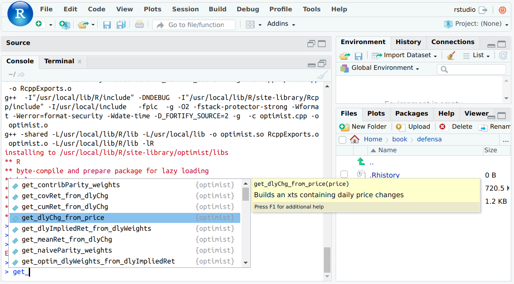

```{r, include=FALSE}
#' @title plotly_xts
#' @description Plots time series from xts
#' @param x xts

plotly_xts <- function(x, ...){
 x %<>%
   as.data.frame() %>%
   tibble::rownames_to_column("date") %>%
   mutate(date = as.Date(date)) %>%
   gather(key, value, -date)

 p <- x %>%
   plot_ly(x = ~date,
           y = ~value,
           color = ~key, ...) %>%
   add_lines()

 p
}
```

# Optimist demo

* Paquetería **R** disponible en github en  [https://github.com/audiracmichelle/optimist](https://github.com/audiracmichelle/optimist)

* En **R** para descargarla se usa

```{}
devtools::install_github("audiracmichelle/optimist")
```

* Para cargarla a la sesión se usa

```{}
library(optimist)
```

* Para probar que se ha cargado en **RStudio** podemos escribir 

```{}
get_
```

y en el drop-down aparecerán varias opciones de la paquetería junto con su descripción y parámetros.

```{r, echo=FALSE}

```

**¿Cómo se usa?**

* `optimist` está inspirada en los lenguajes que usan **sintaxis de lenguaje natural**
* funciona con un flujo secuencial que aprovecha los **pipe operators**


**Cargamos los datos de ETFs sectoriales**

    + IYC - ETF que replica al Dow Jones US Consumer Services Index. Este índice contiene emisiones en US del sector de servicios al consumidor
    + IYE - Dow Jones US Energy Index - sector energético
    + IYH - Dow Jones US Health Care Index - sector de salud
    + IYR - Dow Jones US Real State Index - sector de bienes raíces
    + IYW - Dow Jones US Technology Index - sector de tecnología

```{r, message=FALSE, warning=FALSE}
sectors_price <- get_prices_yahoo(c('IYC', 
                                    'IYE', 
                                    'IYH', 
                                    'IYR', 
                                    'IYW'), 
                                  from = '2012-12-31', 
                                  to = '2018-11-30')
```

```{r}
sectors_price %>% 
  get_dlyChg_from_price() %>% 
  get_cumRet_from_dlyChg() %>% 
  plotly_xts()
```

**Rebalanceo de portafolios**

```{r}
sectors_dlyChg <- get_dlyChg_from_price(sectors_price)

H0 <- c(
  IYC.Adjusted = 0.3, 
  IYE.Adjusted = 0.2, 
  IYH.Adjusted = 0.4, 
  IYR.Adjusted = 0.1, 
  IYW.Adjusted = 0.0
)

Hb <- c(
  IYC.Adjusted = 0.25, 
  IYE.Adjusted = 0.2, 
  IYH.Adjusted = 0.0, 
  IYR.Adjusted = 0.0, 
  IYW.Adjusted = 0.55
)

rebWeight <- xts(rbind(H0, Hb), 
                 order.by = c(index(sectors_dlyChg)[1],
                              as.Date('2017-12-29')))

rebalance <- get_rebalance(sectors_dlyChg, rebWeight) 
```

* valor de un portafolio y contribución de sus componentes

```{r}
plotly_xts(cbind(rebalance$portValue, rebalance$portContrib))
```

* peso diario de las componentes

```{r}
plotly_xts(rebalance$portWeight)
```


<!-- ## Anualización -->

<!-- **Rendimiento promedio** -->

<!-- * anualizado geométrico -->

<!-- $$ -->
<!-- ({\widehat\mu_\mathbf{g}})^{252} = \prod_t \left( {\delta^t}^{252} \right)^\frac{1}{T} -->
<!-- $$ -->

<!-- ```{r} -->
<!-- get_meanRet_from_dlyChg(sectors_dlyChg, annualization_factor = 252) -->
<!-- ``` -->

<!-- * promedio rendimientos móviles anuales -->

<!-- $$ -->
<!-- \prod_{t=252}^T \left( ({\hat\mu}^{t-252,t})^{252} \right)^\frac{1}{T-252+1} -->
<!-- $$ -->

<!-- ```{r} -->
<!-- get_rollChg_from_dlyChg(sectors_dlyChg, -->
<!--                           roll = 252,  -->
<!--                           halflife = 60) ^ 252 %>%  -->
<!--   get_meanRet_from_dlyChg() -->
<!-- ``` -->

<!-- **Riesgo** -->

<!-- * riesgo anualizado -->

<!-- $$ -->
<!-- (\sqrt{252})\widehat\sigma_\mathbf{a} =  -->
<!-- \sqrt{\frac{1}{T-1} \sum_t 252(\delta^t - \widehat\mu_\mathbf{a})^2} -->
<!-- $$ -->

<!-- ```{r} -->
<!-- get_sdRet_from_dlyChg(sectors_dlyChg, annualization_factor = 252) -->
<!-- ``` -->

<!-- * sd rendimientos móviles anuales -->

<!-- $$ -->
<!-- \sqrt{ -->
<!-- \frac{1}{T-252+1} -->
<!-- \sum_{t=252}^T \left( ({\hat\mu}^{t-252,t})^{252} - -->
<!-- \frac{1}{T - 252 + 1}\sum_{t=252}^T ({\hat\mu}^{t-252,t})^{252} -->
<!-- \right)^2} -->
<!-- $$ -->

<!-- ```{r} -->
<!-- get_rollChg_from_dlyChg(sectors_dlyChg,  -->
<!--                         roll = 252,  -->
<!--                         halflife = 60)^252 %>%  -->
<!--   get_sdRet_from_dlyChg() -->
<!-- ``` -->

<!-- ## Relación riesgo-rendimiento -->

<!-- ```{r} -->
<!-- plot_riskReward_from_dlyChg(sectors_dlyChg,  -->
<!--                             roll = 252, -->
<!--                             roll_halflife = 120) -->
<!-- ``` -->

