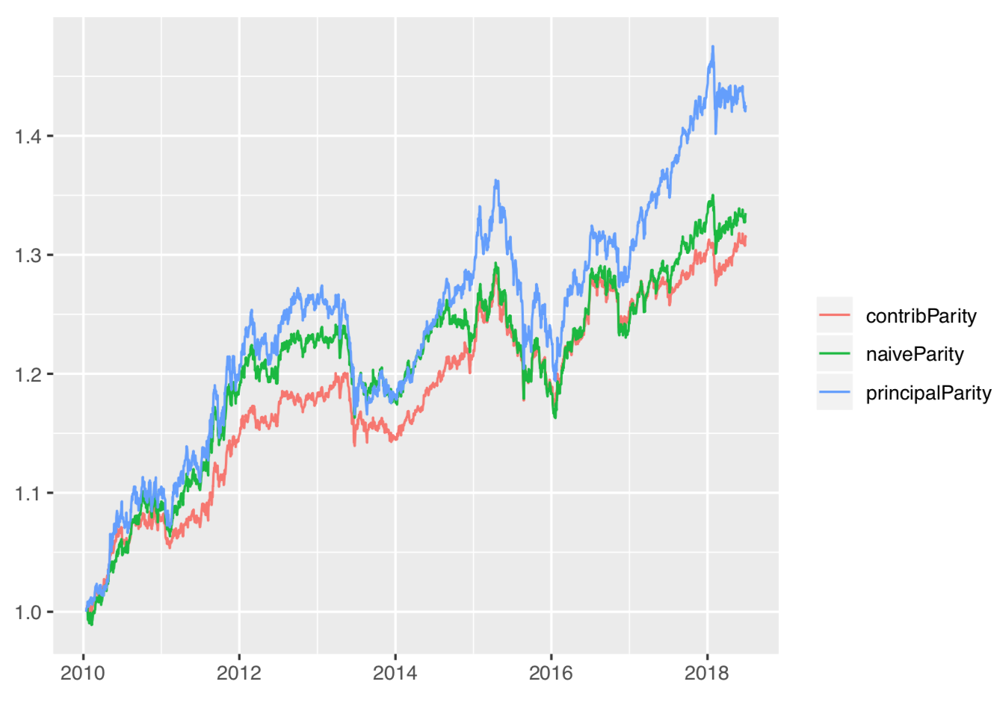
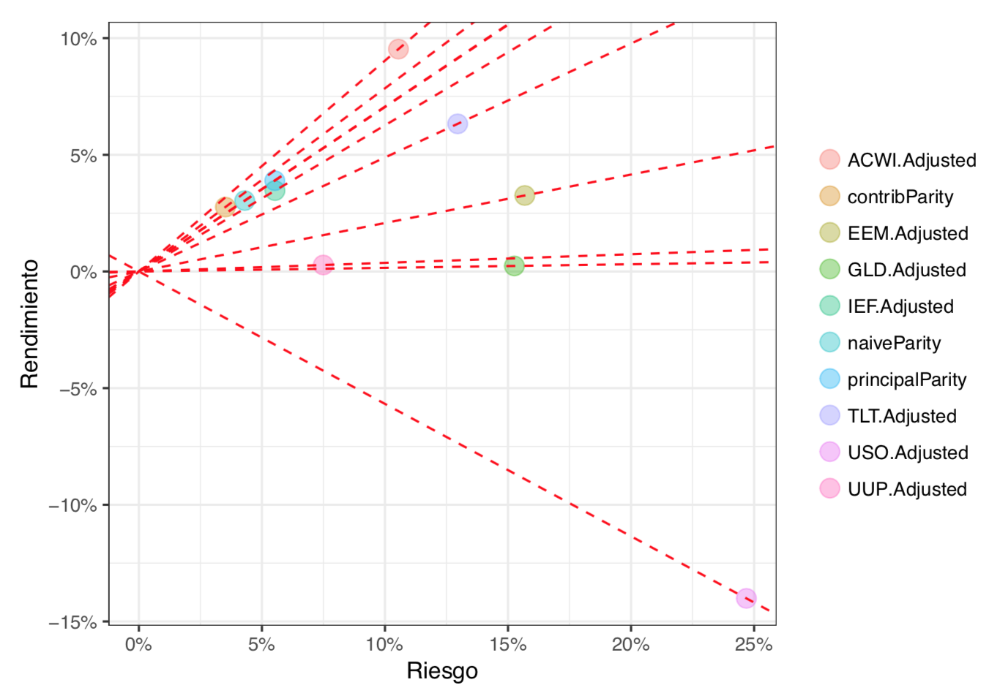

<!-- ```{r, include = FALSE} -->
<!-- library(optimist) -->
<!-- library(plotly) -->
<!-- #' @title plotly_xts -->
<!-- #' @description Plots time series from xts -->
<!-- #' @param x xts -->

<!-- plotly_xts <- function(x, ...){ -->
<!--  x %<>% -->
<!--    as.data.frame() %>% -->
<!--    tibble::rownames_to_column("date") %>% -->
<!--    mutate(date = as.Date(date)) %>% -->
<!--    gather(key, value, -date) -->

<!--  p <- x %>% -->
<!--    plot_ly(x = ~date, -->
<!--            y = ~value, -->
<!--            color = ~key, ...) %>% -->
<!--    add_lines() -->

<!--  p -->
<!-- } -->


<!-- ``` -->

```{r, include=FALSE}
multi <- get_prices_yahoo(c('acwi',
                            'eem',
                            'uso',
                            'tlt',
                            'ief',
                            'gld',
                            'uup'),
                          from = '2008-06-30',
                          to = '2018-11-30')
```

# Paridad de Riesgo

## Portafolio Tradicional

Un portafolio constituido por:

* 60% en el S&P 500 y
* 40% en el Bloomberg Barclays US Aggregate Bond Index.

```{r, echo=FALSE, message=FALSE, warning=FALSE}
traditional <- get_prices_yahoo(c('spy', 'agg'), 
                                from = '2010-12-31', 
                                to = '2018-06-30')
traditional_dlyChg <- get_dlyChg_from_price(traditional)
traditional_cumRet <- get_cumRet_from_dlyChg(traditional_dlyChg)

traditional_rebDates <-
  data.frame(dates = index(traditional_dlyChg)) %>% 
    mutate(quarters = mltools::date_factor(dates, 'yearquarter')) %>% 
    group_by(quarters) %>% 
    summarize(rebdates = min(dates)) %>% 
    pull(rebdates)

traditional_rebWeight <- data.frame(
  SPY.Adjusted = rep(0.6, length(traditional_rebDates)), 
  AGG.Adjusted = rep(0.4, length(traditional_rebDates))
)
traditional_rebWeight <- 
  xts(traditional_rebWeight, order.by = traditional_rebDates)

traditional_rebalance <- 
  get_rebalance(traditional_dlyChg, traditional_rebWeight)
plotly_xts(cbind(
    traditional_rebalance$portValue, 
    traditional_rebalance$portContrib)) 
```

```{r, echo=FALSE}
traditional_sdRet <- get_sdRet_from_dlyChg(
  traditional_dlyChg, method = 'arithmetic') * c(0.6, 0.4)
```

* Multipliquemos el riesgo del S&P 500 por $0.6$ y el riesgo del AGG por $0.4$.
* Calculemos la proporción que representan estos riesgos con respecto a la suma de los dos
    + El riesgo del SPY representa el `r sprintf("%0.2f", as.numeric(traditional_sdRet[1] / sum(traditional_sdRet)) * 100)`% de la suma del riesgo de los ETFs
    + El riesgo del AGG representa el `r sprintf("%0.2f", as.numeric(traditional_sdRet[2] / sum(traditional_sdRet)) * 100)`%.

**La asignación de riesgo de la combinación 60/40 se encuentra poco balanceada**.

## ETFs Multiactivos

* **ETF's multiactivos**
    * ACWI - MSCI's All Country World Index - índice de capitalización de mercado de acciones listadas en todo el mundo
    * EEM - Emerging Markets Index - índice de capitalización de mercado de acciones listadas en países emergentes
    * USO -  Front Month Light Sweet Crude Oil Index - fondo compuesto por futuros de precios de petróleo
    * GLD - Precio del oro - fondo invertido directamente en oro físico
    * UUP - Deutsche Bank Long USD Currency Portfolio Index - índice que representa la fortaleza del dólar americano relativo a una canasta de seis monedas: el euro, el yen, la libra, el dólar canadiense, la corona sueca y el franco suizo.


```{r, echo=FALSE}
dlyChg <- get_dlyChg_from_price(multi)
cumRet <- get_cumRet_from_dlyChg(dlyChg)
plotly_xts(cumRet)
```

## Paridad de Riesgo Ingenua

La construcción de portafolios con **paridad ingenua de riesgo** consiste en asignar a cada activo $i$ un peso dado por 

$$
h_i =\frac{1/\hat\sigma_i}{\sum_{i = 1}^n 1/\hat\sigma_i} \;.
$$

**Con los pesos de paridad ingenua, se cumple que** 

$$\hat\sigma_1 h_1 = \hat\sigma_2 h_2 = \ldots = \hat\sigma_n h_n$$

Si el riesgo de un portafolio fuera la suma ponderada de los riesgos de sus componentes entonces, usando los pesos de paridad ingenua de riesgo, cada componente aportaría la misma cantidad de riesgo.

```{r, include=FALSE}
naiveParity_weights <- get_naiveParity_weights(dlyChg, halflife = 160)
sdRet <- get_sdRet_from_dlyChg(dlyChg, halflife = 160) 
```

```{r}
sdRet * naiveParity_weights
```

**El inconveniente de los pesos de paridad de riesgo es que ignoran las correlaciones que existen entre los activos*

## Paridad de Contribución al Riesgo

**contribución marginal al riesgo**

A $\frac{\partial\hat\sigma_\text{p}}{\partial h_i}$ lo llamaremos la contribución marginal al riesgo del componente $i$ del portafolio. El vector de contribuciones marginales al riesgo está dado por $\frac{\hat\Sigma h}{\sqrt{h^T \hat\Sigma h}}$.

$$
\frac{\partial\widehat\sigma_\text{p}}{\partial h_i} = \frac{\sum_j \widehat\sigma_{ij} h^j}{\sqrt{h^T \hat\Sigma h}} = \frac{(\Sigma h)_i}{\sqrt{h^T \hat\Sigma h}} \;.
$$

**contribución total al riesgo del componente $i$ del portafolio**

A $h_i\frac{\partial\hat\sigma_\text{p}}{\partial h_i}$ lo llamaremos la contribución total al riesgo del componente $i$ del portafolio.

$$
\sum_i h_i\frac{(\hat\Sigma h)_i}{\sqrt{h^T \hat\Sigma h}}=\frac{h^T \hat\Sigma h}{\sqrt{h^T \hat\Sigma h}} = \sqrt{h^T \hat\Sigma h} \;.
$$

Se cumple que el riesgo total del portafolio es la suma de las contribuciones totales al riesgo pues

**formulación del problema de paridad de contribución al riesgo**

Encontrar **un portafolio tal que las contribuciones totales al riesgo sean igual para todas las componentes del portafolio**

$$
\begin{aligned}
\min_{h} & & 
\sum_i\sum_j\left(h_i(\Sigma h)_i - h_j(\Sigma h)_j\right)^2 \\
\text{sujeto a} & &
h^T \mathbf{1} = 1\\
& &h \geq 0
\end{aligned}
$$

**Con los pesos de paridad de contribución al riesgo, se cumple que**

$$h_1(\hat\Sigma h)_1 = h_2(\hat\Sigma h)_2 = \ldots = h_n(\hat\Sigma h)_n$$

```{r, include=FALSE}
contribParity_weights <- get_contribParity_weights(dlyChg, 
                                                   halflife = 160)
covRet <- get_covRet_from_dlyChg(dlyChg, halflife = 160)
```

```{r}
contribParity_weights * covRet %*% contribParity_weights
```

## Paridad de Fuentes de Riesgo

Si invertimos $h$ en un portafolio, entonces invertimos $\mathbf{p}_i^\top h$ en el $i$-ésimo portafolio principal

$$
\lambda_i (\mathbf{p}_i^\top h)^2 = \lambda_j (\mathbf{p}_j^\top h)^2 \quad \text{ para toda } \quad i,j = 1,...,K.
$$

**formulación del problema de paridad de fuentes de riesgo**

$$
\begin{aligned}
\min_{h} & & \sum_i\sum_j 
\left( \lambda_i (\mathbf{p}_i^\top h)^2  - \lambda_j (\mathbf{p}_j^\top h)^2 \right)^2\\
\text{sujeto a} & & h^T \mathbf{1} = 1 \\
& & h \geq 0
\end{aligned}
$$

**Con los pesos de paridad de fuentes de riesgo se cumple, eligiendo tres fuentes de riesgo, que**

$$\lambda_1 (p_1^\top h)^2 = \lambda_j (p_2^\top h)^2= \lambda_i (p_3^\top h)^2$$

```{r, include=FALSE}
T <- nrow(dlyChg) 
w <- get_w_with_geomTruncDecay(T=T, halflife = 160)
Sigma <- cov.wt(dlyChg, w)$cov 
eig <- eigen(Sigma, symmetric=TRUE) #eigen vectors - loadings

evec <- eig$vectors
eval <- eig$values

heq <- function(x) {
    sum(x) - 1
}

heqjac <- function(x) {
    rep(1, length(x))
}

principal_parity_weights <- 
  get_principalParity_weights(  
    dlyChg, 
    halflife = 160, 
    num_factors = 3)
```

```{r}
eval * (principal_parity_weights %*% evec)^2
```

## Índices de Paridad de Riesgo

* Se calculan los pesos diarios de paridad de riesgo
* Se construyen portafolios con rebalanceos diarios

**retorno acumulado**

```{r, echo=FALSE, out.width="80%", fig.align="center"}

```

**relación riesgo-rendimiento**

```{r, echo=FALSE, out.width="80%", fig.align="center"}

```
