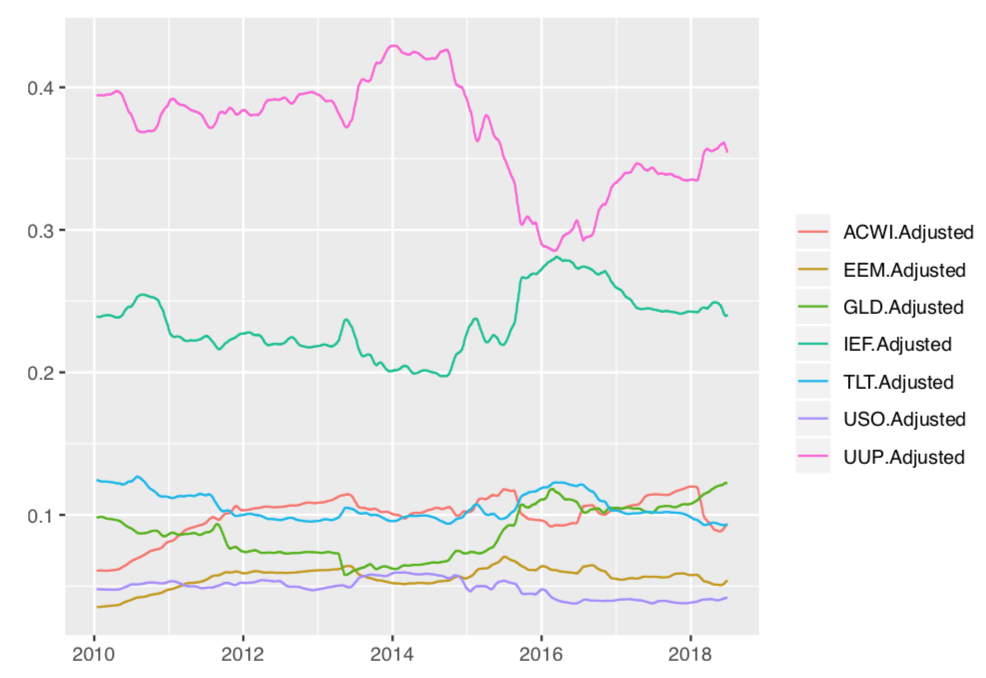
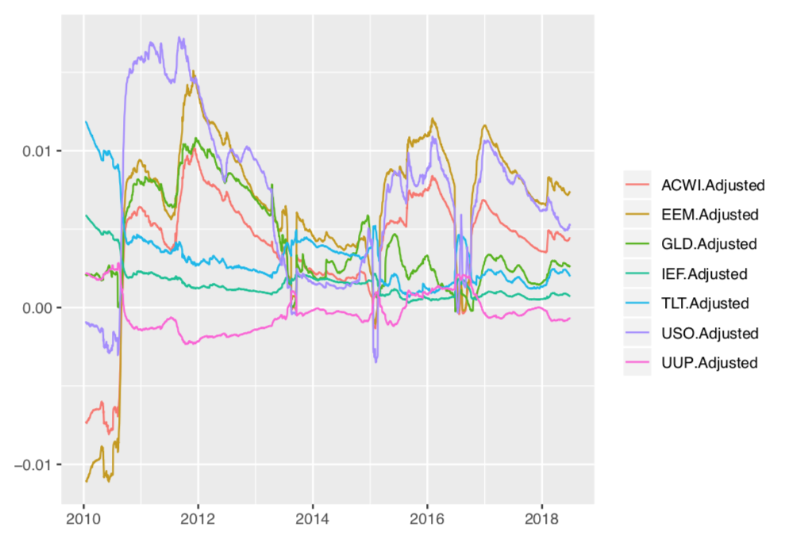
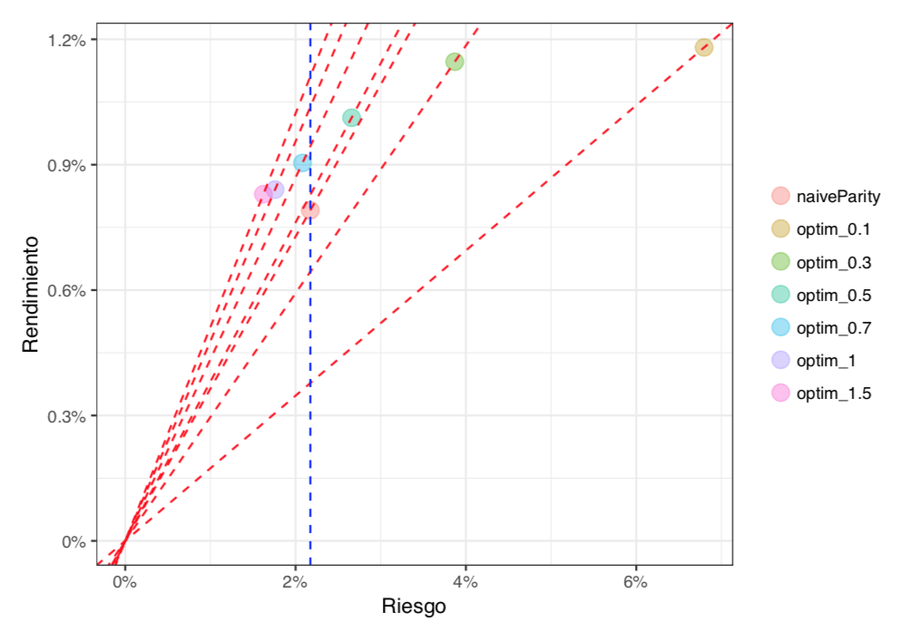
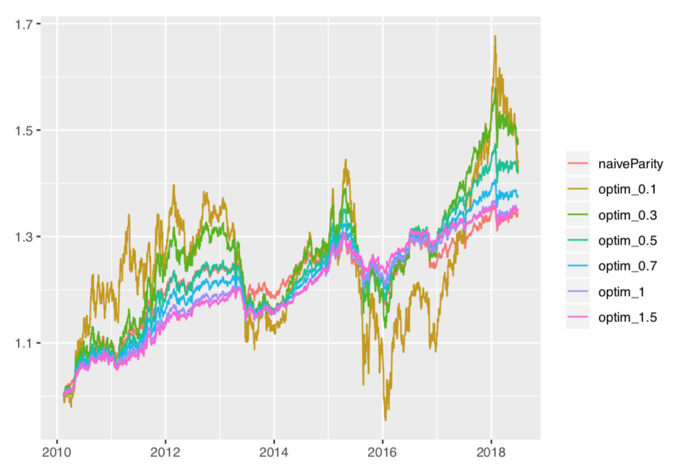

# Estrategia de Inversión

## Portafolio de referencia

Se define como **portafolio de referencia (benchmark)** al índice de paridad de contribución al riesgo (con rebalanceos diarios).

**pesos del benchmark**

```{r, echo=FALSE, out.width="80%", fig.align="center"}

```

## Rendimientos implícitos

Se obtienen **rendimientos implícitos diarios** a partir del índice de paridad de fuentes de riesgo

---

En la **optimización inversa**, los pesos $h^*$ son conocidos y los rendimientos $\mu^*$ son la variable que desconocemos. 

Fijando el valor de $\delta=1$ en el problema Markowitz y usando la matriz de covarianzas empírica tenemos que 

$$
  \mu^* = \hat\Sigma h^* \;.
$$

A los rendimientos en $\mu^*$ se les llama **rendimientos implícitos**. 

---

**rendimientos implicitos diarios**

```{r, echo=FALSE, out.width="80%", fig.align="center"}

```

## Curva eficiente

Se construye una **curva eficiente** de portafolios óptimos con rebalanceos diarios usando Markowitz tradicional. Se elige una $\delta$.

**curva eficiente**

```{r, echo=FALSE, out.width="80%", fig.align="center"}

```

**rendimientos acumulados de portafolios óptimos**

```{r, echo=FALSE, out.width="80%", fig.align="center"}

```
