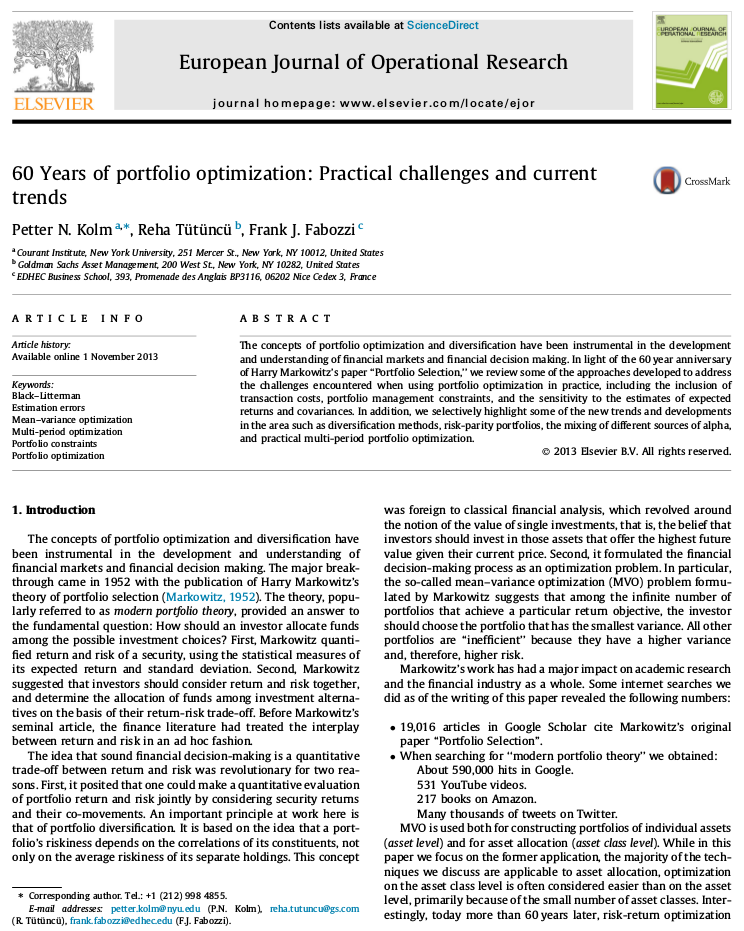

```{r, include=FALSE}
library(optimist)
pkgs <- c('xts', 'quantmod', 'nloptr', 'tidyverse', 'mltools', 'Rcpp', 'plotly')
lapply(pkgs, require, character.only = TRUE)
```

# Motivación

* Curso de Matemáticas Financieras II
* Experiencia como Product Manager en MSCI y como Portfolio Manager en CI Banco
* Tendencias:


**Publicaciones de R Series**

```{r, echo=FALSE, out.width="30%", fig.align="center"}
knitr::include_graphics("./rseries.png")
```

**Multi-Asset Class Factor Analysis**

```{r, echo=FALSE, out.width="50%", fig.align="center"}

```

**60 Years of Portfolio Optimization**

```{r, echo=FALSE, out.width="50%", fig.align="center"}

```

